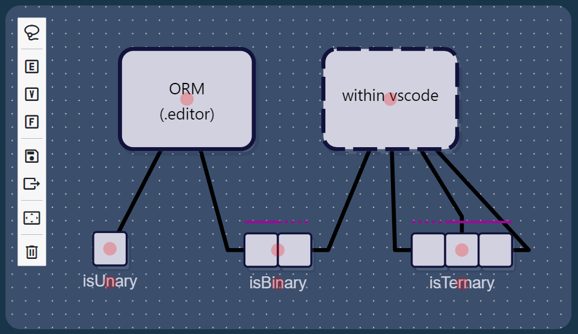

# qORMa - An ORM editor for vscode

This extension is a simple and "lightweight" implementation of the ORM schema and provided a simple graphical interface for building ORM schemas. The project is a work in progress and aims to capture the minimum features of the full ORM language. It provides a diagram interface suited to ORM models. It builds on top of the Camunda framework [diagram-js](https://github.com/bpmn-io/diagram-js).

If you are after a more verbose and powerful tool to explore the full extent of ORM then we would suggest that you try out [NORMA](https://marketplace.visualstudio.com/items?itemName=ORMSolutions.NORMA2019) in visual studio (now on the marketplace of extensions!). However, our extension focuses on the interaction side of making the schema rather than the wonderful formal compontents, like fact verbalisation available in NORMA.

## Features

At this stage, we support the following components of the ORM language:
- Entities
    - Referenced or unit-based referenced
- Value Entities
    - with a single name
- Facts
    - of any desired arity
    - uniqueness constraints
    - derivation labels
    - objectified (limited support)
    - connections between facts and entities
        - mandatory roles on connections

For instance, you can see the graphical representation of these elements in the following snippet:

## Requirements

The editor does not require installing any third library software packages. The extension has been built to run within vs-code as-is. We have developed the extension using a combination of javascript and typescript, for better or worse.

## Extension Settings

We currently do not expose any settings for the extension.

## Release Notes

The following section capture the most recent releases.

### 0.1.0

Initial release of the ORM editor for testing purposes.
